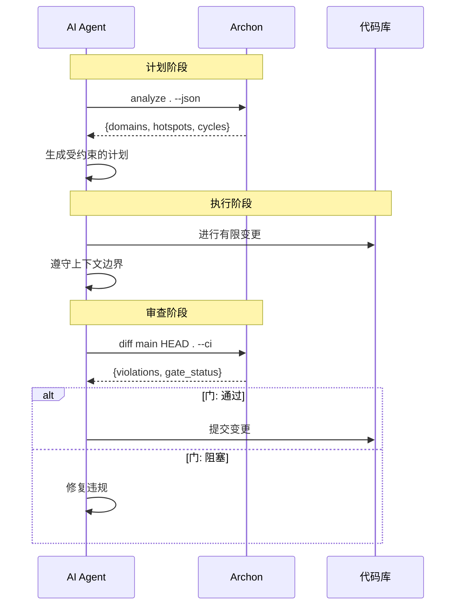

# Archon

> **结构约束驱动的 AI 重构流水线**

Archon 是一个将架构分析直接集成到 AI 驱动代码修改工作流中的系统。

它将重构从临时的、模型驱动的过程转变为一个**结构化、可验证、可反馈控制的流水线**。

[English](README.md) | [中文文档](README-zh.md)

---
## 设计理念

- 结构比代码更重要
- 约束提高模型可靠性
- AI 应该在系统内运行，而不是替代它
- 重构是一个受控的转换过程，而不是创造性活动

---

## 核心特性

- **受约束的 AI 行为** — 非自由生成
- **架构感知的上下文注入**
- **计划 → 执行 → 验证循环**
- **Diff 级结构审查**
- **概率模型之上的确定性验证**

---

## 多语言支持

| 语言 | 解析器 | 状态 |
|----------|--------|--------|
| Java | 基于反射 | 内置 |
| JavaScript/TypeScript | Closure Compiler | 内置 |
| Python | 导入解析器 | 内置 |
| Vue | SFC 脚本提取 | 内置 |

---

## 使用场景

- 大型 monorepo 重构
- 服务边界清理
- 依赖循环消除
- 渐进式架构迁移
- AI 辅助代码审查增强

## 问题

现代 coding agent 在强大的生产力中又引入了以下问题：

- ai 不了解系统边界和结构
- ai 重构时常破坏系统架构
- 引入 ai 重构时不时会让人担心“它改了什么，以前是什么样，现在又是什么样”
- 架构知识未被明确用作约束

---

## 解决方案

Archon 引入了一个将结构分析与代码修改紧密耦合的结构化流水线：

### 1. 预分析（计划阶段）

在修改代码之前，对代码库进行结构分析，并作为上下文输入至 planning ：

- 模块边界
- 依赖图
- 风险热点
- 目标变更的影响范围


### 2. 约束执行（执行阶段）

AI 在结构约束下运行：

- 有限的作用域上下文窗口
- 显式的变更意图（面向 diff 的执行）
- 架构边界感知


### 3. 合并前验证（审查阶段）

在合并之前，进行二次评估：

- 基于 diff 的结构影响分析
- 跨模块依赖验证
- 与预分析快照的一致性检查

---

## 完整工作流图



---


## 快速开始

### 安装

从 [releases](https://github.com/Schr0d/Archon/releases) 下载最新的 shadow JAR：

```bash
# 或从源码构建
./gradlew shadowJar
```

### 基本使用

```bash
# 交互式 Web 可视化（打开浏览器）
java -jar archon.jar view /path/to/project

# 使用终端输出分析
java -jar archon.jar analyze /path/to/project

# 导出静态 HTML 图表
java -jar archon.jar view /path/to/project --export diagram.html

# 使用 Web 查看器进行 diff（红色=删除，绿色=添加，黄色=修改）
java -jar archon.jar diff main HEAD /path/to/project --view

# 检查修改特定模块的影响
java -jar archon.jar impact com.example.Service /path/to/project

# 根据架构规则进行验证
java -jar archon.jar check /path/to/project --ci
```

---

## AI Agent 工作流

Archon 设计为在开发循环中被 AI agent 调用。以下是集成方式：

### 阶段 1：计划 — AI 获取架构上下文

```bash
# Agent 在提议变更之前运行分析
$ java -jar archon.jar analyze . --json > archon-context.json
```

AI agent 收到：

```json
{
  "domains": [
    {"name": "core", "nodes": 45, "boundaries": ["com.archon.core.*"]},
    {"name": "java", "nodes": 12, "boundaries": ["com.archon.java.*"]},
    {"name": "cli", "nodes": 8, "boundaries": ["com.archon.cli.*"]}
  ],
  "hotspots": [
    {"node": "com.archon.core.graph.DependencyGraph", "inDegree": 18, "risk": "HIGH"},
    {"node": "com.archon.core.plugin.LanguagePlugin", "inDegree": 7, "risk": "MEDIUM"}
  ],
  "cycles": [],
  "blindSpots": [
    {"type": "CommonJS", "count": 624, "file": "archon-viz/src/main/resources/lib/dagre.min"}
  ]
}
```


### 阶段 2：执行 — AI 进行受约束的变更

可通过上下文直接载入


### 阶段 3：审查 — AI 验证结构完整性

```bash
# Agent 在提交之前验证变更
$ java -jar archon.jar diff main HEAD . --ci
```

审查门返回：

```
=== 结构影响审查 ===

新增边: 2
  com.auth.service → com.payment.client [跨域] ⚠️
  com.payment.dao → com.database.pool [同域]

删除边: 1
  com.auth.util → com.logging.helper

违规: 1
  ✗ max_cross_domain 超限（当前: 4，限制: 3）
    → com.auth.service → com.payment.client

门: 阻塞
```

**AI 响应：**
- 回滚跨域违规
- 在架构约束内重新规划
- 使用干净的 diff 重新验证

---

## CLI 命令

```
archon view <path> [--port] [--no-open] [--export <file>] [--idle-timeout <min>]
archon analyze <path> [--json] [--dot <file>] [--mermaid <file>] [--verbose]
archon impact <module> <path> [--depth N]
archon check <path> [--ci]
archon diff <base> <head> <path> [--ci] [--depth N] [--view]
```

---

## 配置

在项目根目录创建 `.archon.yml`：

```yaml
rules:
  no_cycle: true
  max_cross_domain: 3
  max_call_depth: 3
  forbid_core_entity_leakage: true

critical_paths:
  - com.example.auth
  - com.example.payment

domains:
  com.example.*:
    - ".*\\.service\\..*"
```

---


## 架构

```
archon-core/     — 语言无关的图模型、分析引擎、SPI
archon-java/     — Java 解析器插件
archon-js/       — JavaScript/TypeScript 解析器插件
archon-python/   — Python 导入解析器插件
archon-viz/      — Web 可视化和导出格式
archon-cli/      — 带有 shadow JAR 打包的 CLI
archon-test/     — 共享测试固件
```

---

## 构建

```bash
# 运行所有测试
./gradlew test

# 构建 shadow JAR
./gradlew shadowJar

# 输出: archon-cli/build/libs/archon-<version>.jar
```

---

## 路线图

- [x] v0.1 — CLI + 基础分析
- [x] v0.2 — 基于 diff 的分析
- [x] v0.3 — 多语言 SPI
- [x] v0.4 — 安全加固 + Vue 支持
- [x] v0.5 — 可视化（Web UI）
- [ ] v0.6 — 跨语言边检测
- [ ] v1.0 — 完整的 AI 重构流水线集成

---

## 状态

实验性 / 早期系统设计

不是编码助手 — 而是一个**代码演进控制系统**

---

## 贡献

参见 [TODOS.md](TODOS.md) 了解延期工作和贡献机会。

## 许可证

MIT

## 致谢

Web 查看器采用了 [oh-my-mermaid](https://github.com/oh-my-mermaid/oh-my-mermaid) 的方法（MIT 许可）。

## 链接

- [skill.md](skill.md) — AI agent 集成指南
- [CHANGELOG.md](CHANGELOG.md) — 版本历史
- [TODOS.md](TODOS.md) — 延期工作
