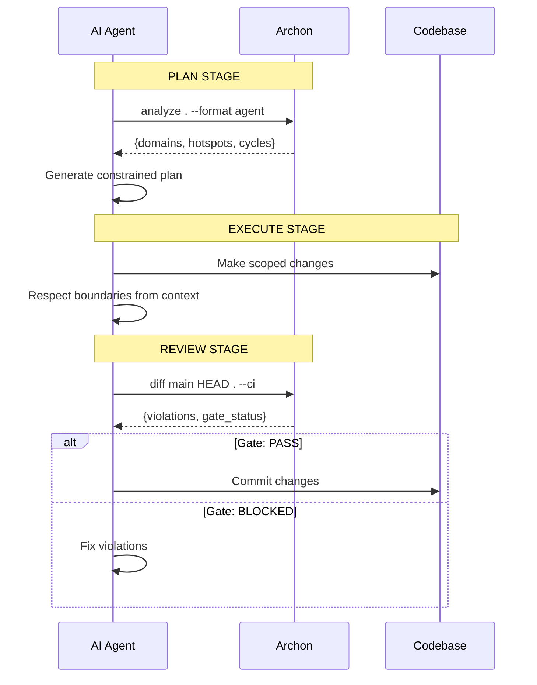

# Archon

> **Structure-Constrained AI Refactoring Pipeline**

[English](README.md) | [中文文档](README-zh.md)

Archon is a system that integrates architectural analysis directly into AI-driven code modification workflows.

It turns refactoring from an ad-hoc, model-driven process into a **structured, verifiable, and feedback-controlled pipeline**.

---

## Problem

Modern AI coding tools are powerful, but unstable in large-scale systems:

- They modify code without understanding system boundaries
- Refactoring decisions are opaque and non-deterministic
- Reviews happen too late, often after structural damage is done
- Architecture knowledge is not explicitly used as a constraint

**Result:** AI-assisted refactoring becomes fast but unsafe.

---

## Solution

Archon introduces a structured pipeline that tightly couples structural analysis with code modification:

### 1. Pre-Analysis (Plan Stage)

Before any code change, perform structural analysis of the repository:

- Module boundaries
- Dependency graph
- Risk hotspots
- Impact surfaces of target changes

This becomes **explicit input context for the AI**.

### 2. Constrained Execution (Act Stage)

The AI operates under structural constraints:

- Scoped context windows
- Explicit change intent (diff-oriented execution)
- Architectural boundary awareness

This turns generation into **bounded transformation**.

### 3. Pre-Merge Verification (Review Stage)

Before merging, perform a second-pass evaluation:

- Diff-based structural impact analysis
- Cross-module dependency validation
- Consistency checks against pre-analysis snapshot

This acts as an **automated architecture-aware review layer**.

---

## Core Idea

> Move architecture from documentation → runtime constraint system

Archon is not just a code analyzer. It is a **closed-loop control system for AI-driven code evolution**.

---

## Quick Start

### Prerequisites

- **Java 17** (OpenJDK 17+, e.g. [Eclipse Adoptium Temurin](https://adoptium.net/))

### Installation

Download the latest shadow JAR from [releases](https://github.com/Schr0d/Archon/releases):

```bash
# Or build from source
./gradlew shadowJar
```

### Basic Usage

```bash
# Full dependency analysis
java -jar archon.jar analyze /path/to/project

# Impact analysis — what breaks if you change a module?
java -jar archon.jar analyze /path/to/project --target com.example.Service

# Machine-readable JSON for AI tools
java -jar archon.jar analyze . --format agent

# Blast radius of uncommitted changes
java -jar archon.jar diff

# Diff between branches
java -jar archon.jar diff main feature-branch
```

### Claude Code Integration

Archon ships a native Claude Code skill. Type `/archon diff` in Claude Code to see the blast radius of your uncommitted changes, or `/archon analyze` for a full dependency map. See [skill.md](skill.md) for details.

---

## AI Agent Workflow

Archon is designed to be called by AI agents during the development loop.

**Using Claude Code?** Type `/archon diff` or `/archon analyze` for instant impact analysis. The skill auto-detects JDK 17 and handles JAR building. See [skill.md](skill.md) for the full integration guide.

Here's how the manual integration works:

### Stage 1: Plan — AI Gets Architectural Context

```bash
# Structured JSON output with graph, metrics, and blind spots
$ java -jar archon.jar analyze . --format agent
```

The agent output includes nodes with metadata (PageRank, betweenness, impact score, risk level), edges, domain groupings, cycles, hotspots, and blind spots.

**AI uses this to:**
- Avoid high-risk hotspots (high PageRank = high impact)
- Respect domain boundaries
- Stay within safe change surfaces
- Declare uncertainty for blind spots
- Understand bridge nodes (removal increases fragmentation)

---

### Stage 2: Execute — AI Makes Constrained Changes

```python
# AI agent internal state
archon_context = load("archon-context.json")

# Agent plans refactoring with constraints
def plan_refactoring(target):
    if target in archon_context["hotspots"]:
        return f"SKIP: {target} is HIGH-RISK hotspot (inDegree: 18)"

    impact = archon.impact(target)
    if impact.cross_domain > 3:
        return f"SKIP: {target} affects {impact.cross_domain} domains"

    return generate_safe_refactoring_plan(target, archon_context)
```

**AI is constrained by:**
- Pre-calculated impact surface
- Domain boundary rules
- Risk hotspot avoidance
- Explicit scope limits

---

### Stage 3: Review — AI Verifies Structural Integrity

```bash
# Agent validates changes before committing
$ java -jar archon.jar diff main HEAD
```

The review gate returns:

```
=== Structural Impact Review ===

Added edges: 2
  com.auth.service → com.payment.client [CROSS-DOMAIN] ⚠️
  com.payment.dao → com.database.pool [SAME-DOMAIN]

Removed edges: 1
  com.auth.util → com.logging.helper

Violations: 1
  ✗ max_cross_domain exceeded (current: 4, limit: 3)
    → com.auth.service → com.payment.client

Gate: BLOCKED
```

**AI responds:**
- Rollback cross-domain violation
- Re-plan within architectural constraints
- Re-verify with clean diff

---

## Migration Guide

### v0.7.1 — Command Consolidation

CLI simplified to two commands: `analyze` and `diff`. Previous commands mapped as follows:

| Old Command | New Equivalent |
|-------------|---------------|
| `archon view <path>` | `archon analyze <path>` |
| `archon impact <module> <path>` | `archon analyze <path> --target <module>` |
| `archon check <path>` | Removed (use `diff` for CI checks) |
| `archon view . --format json` | `archon analyze . --format agent` |

---

## Full Workflow Diagram



---

## Key Properties

- **Constrained AI behavior** — not free-form generation
- **Architecture-aware context injection**
- **Plan → Execute → Verify loop**
- **Diff-level structural review**
- **Deterministic validation on top of probabilistic models**

---

## Multi-Language Support

| Language | Parser | Status |
|----------|--------|--------|
| Java | Reflection-based + ArchUnit | Built-in |
| JavaScript/TypeScript | dependency-cruiser | Built-in |
| Python | Import parser | Built-in |
| Vue | SFC script extraction | Built-in |

---

## Use Cases

- Large monorepo refactoring
- Service boundary cleanup
- Dependency cycle removal
- Gradual architecture migration
- AI-assisted code review augmentation

---

## CLI Commands

```
archon analyze <path> [--target <module>] [--depth N] [--format agent] [--verbose]
archon diff [base head] [--format agent]
```

---

## Design Philosophy

- Structure is more important than code
- Constraints improve model reliability
- AI should operate inside a system, not replace it
- Refactoring is a controlled transformation process, not a creative act

---

## Architecture

```
archon-core/     — Language-agnostic graph model, analysis engines, SPI
archon-java/     — Java parser plugin (with Spring DI post-processor)
archon-js/       — JavaScript/TypeScript parser plugin
archon-python/   — Python import parser plugin
archon-cli/      — CLI with shadow JAR packaging
```

---

## Building

```bash
# Run all tests
./gradlew test

# Build shadow JAR
./gradlew shadowJar

# Output: archon-cli/build/libs/archon-<version>.jar
```

---

## Roadmap

- [x] v0.1 — CLI + basic analysis
- [x] v0.2 — Diff-based analysis
- [x] v0.3 — Multi-language SPI
- [x] v0.4 — Security hardening + Vue support
- [x] v0.5 — Visualization (web UI)
- [x] v0.6 — Cross-language edge detection
- [x] v0.7 — JS/TS rewrite + Spring DI detection + command consolidation
- [ ] v1.0 — Full AI-refactoring pipeline integration

---

## Status

Experimental / early-stage system design

Not a coding assistant — a **code evolution control system**

---

## Contributing

See [TODOS.md](TODOS.md) for deferred work and contribution opportunities.

## License

MIT

## Acknowledgments

Uses [ArchUnit](https://archunit.org/) for Java bytecode analysis (Apache 2.0).

## Links

- [skill.md](skill.md) — AI agent integration guide
- [CHANGELOG.md](CHANGELOG.md) — Version history
- [TODOS.md](TODOS.md) — Deferred work
